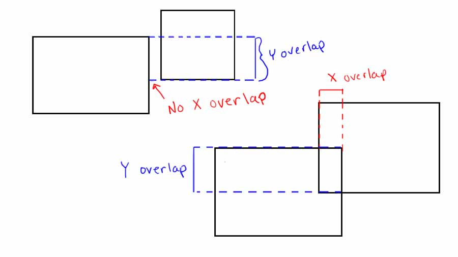
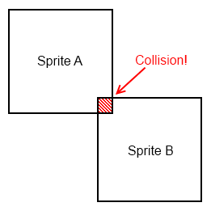

# Collision Detection

I recommend creating a new file called `util.go` which will store our miscellaneous utility functions.
We briefly discussed in class how `Wrap` no longer belongs in `asteroid.go` because we generalized it
to all sprites, not just asteroids. I recommend you move that function into `util.go` (this is just re-organization of the code).

**Note:** remember to import all the necessary packages properly.

Now, in `util.go` create an `Intersects` function which will determine if two sprites are colliding with each other.

The function will take two sprites as input and return a boolean specifying if they are colliding or not (true or false):

```go
func Intersects(s1, s2 *sf.Sprite) bool {
    // Your code...
}
```

Think about how you might determine if two sprites are colliding. Essentially, we can treat them as just rectangles. These rectangles aren't rotated either so this simplifies the problem further to just a little geometry.

we know the center of each sprite:

```go
pos1 := s1.GetPosition()
x1 := pos1.X
y1 := pos1.Y

pos2 := s2.GetPosition()
x2 := pos2.X
y2 := pos2.Y
```

and we know the width and height:

```go
size1 := s1.GetGlobalBounds()
width1 := size1.Width
height1 := size1.Height

size2 := s2.GetGlobalBounds()
width2 := size2.Width
height2 := size2.Height
```

Here are some images to help you visualize:





If you're stumped on how to implement this, there is a shortcut (but please think about it a bit first!).

The `GetGlobalBounds()` function isn't just useful for finding the width and the height of a sprite. It also has an `Intersects` method already written. Check it out in the [documentation](https://godoc.org/gitlab.com/tapir/sfml/v2.3/sfml#Rectf)

Here is the definition (`GetGlobalBounds()` returns a `sf.Rectf` object):

```go
func (f sf.Rectf) Intersects(other sf.Rectf) (bool, Rectf)
```

Since the function returns to objects, and we only care about the boolean, we will just throw away the second return object.

Here's a small example to get you started:

```go
doTheyIntersect, _ := bounds1.Intersects(bounds2)
```

# Destroying Asteroids

During last class, we added a `dead` boolean to the `Laser` struct to determine when a laser should be removed from the game. We used
this to destroy lasers when they go off the screen but this is also very useful for destroying asteroids.

Add a similar `dead` boolean to the `Asteroid` struct (some of you may have already done this in class). Then at the end of the main
game loop, remember to remove all asteroids from the `asteroids` array (this is very similar to the removal of all dead lasers we already wrote there).

Here is the removal loop we wrote for the lasers:

# Checking collisions

Now in the main game loop, before all the sprites are drawn, you can loop through all lasers, and check if each is intersecting with an asteroid.
If so, set the laser to `dead` and the asteroid to `dead` so they will both be removed at the end of the frame.

It's a bit tricky to check all lasers with all asteroids because you need a double for loop. For each laser object, you need to check all the asteroids
to see if there is a collision with any of them. 

Here's some pseudocode for you:

```
for every laser {
    for every asteroid {
        if the laser intersects with the asteroid {
            set dead to true for both of them
        }
    }
}
```

To check if a `laser` intersects with an `asteroid`, remember that you must pass in the `Sprite` not the object itself:

```go
if Intersects(laser.Sprite, asteroid.Sprite) {
    // Collision!
}
```
